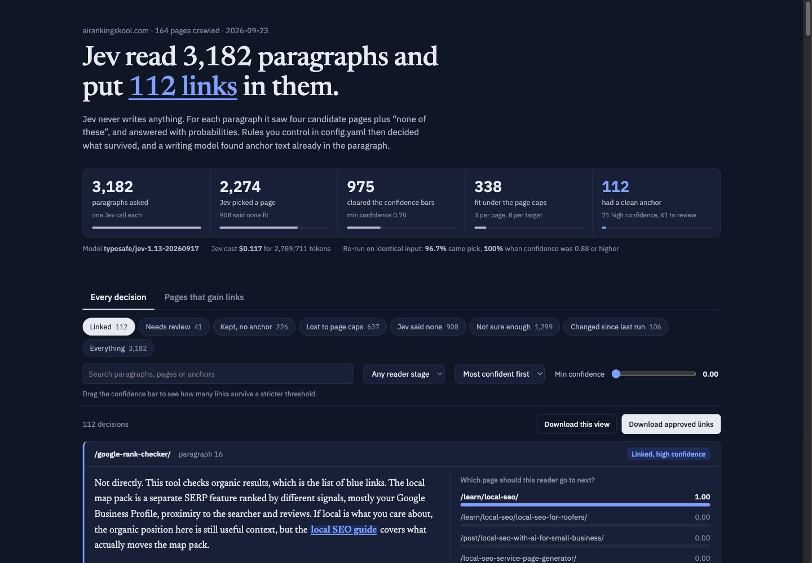

# Jev Internal Links

Find every internal link your site is missing, with one command and about $1.

This skill for Claude Code crawls your site, asks **Jev** (TypeSafe AI's decision model) which page each paragraph should link to, applies rules you control, and hands you a report you can approve from.



## What it does

1. **Crawls** every page in your sitemap and splits it into paragraphs. This step is free.
2. **Shortlists** the 4 most related pages for each paragraph, using a small model that runs on your computer. This step is also free.
3. **Asks Jev**, in one call per paragraph: which of these pages is the most useful next step for this reader, or none? It also asks whether the paragraph needs a link, whether there's a natural phrase to link, where the reader is (learning, comparing or ready to buy), and whether the paragraph is a sales pitch. Jev answers with probabilities, not text. About $0.04 per 1,000 paragraphs.
4. **Applies your rules** from `config.yaml`:
   - a minimum confidence
   - at most 3 new links per page and 8 per target
   - one link per page-and-target pair
   - a bonus for pages nothing links to, and for your offer pages when the reader is ready to buy

   This step is free, and you can re-run it as often as you like.
5. **Picks anchor text** with Claude. The anchor must already be in the paragraph, word for word, so nothing on your page gets rewritten. About $0.60 per 150 pages.
6. **Builds the report**: an interactive dashboard, a styled spreadsheet and CSVs.

On a 164-page site: 3,182 Jev decisions, 112 links proposed, $0.75 total.

## Install

You need [Claude Code](https://claude.com/claude-code), Python 3.10+ and an [OpenRouter](https://openrouter.ai/keys) API key with a few dollars of credit.

```bash
git clone https://github.com/NicoSKOOL/jev-internal-links ~/.claude/skills/jev-internal-links
pip install -r ~/.claude/skills/jev-internal-links/requirements.txt

mkdir -p ~/.config/jev-internal-links
echo 'OPENROUTER_API_KEY=sk-or-YOUR-KEY' > ~/.config/jev-internal-links/.env
chmod 600 ~/.config/jev-internal-links/.env
```

## Use

In Claude Code, just ask:

> Find internal linking opportunities for example.com

Or run it yourself:

```bash
python ~/.claude/skills/jev-internal-links/scripts/run.py https://example.com
```

The report opens when it's done. Everything is saved in `./jev-links/example.com/`.

Then open `jev-links/example.com/config.yaml`, list your offer pages under `money_pages`, and run the same command again. Re-runs are nearly free, because every answer is cached.

## What you get

| File | Use it to |
|---|---|
| `out/jev-dashboard.html` | Read every decision in context, drag the confidence slider, approve or reject links, and export the approved ones |
| `out/jev-decisions.xlsx` | Work in a spreadsheet. Upload it to Google Drive and it opens as a formatted Google Sheet |
| `out/internal-links.csv` | Give your developer or VA the approved list |

## Good to know

- **Jev is cheaper and faster, not smarter.** On TypeSafe's own benchmark it scores below Claude Opus and GPT-5.6. It's here for high-volume "pick one" and "yes or no" calls. A human still approves the list.
- **Consistent where it counts.** Run twice on the same input, Jev made the same pick 96.7% of the time, and 100% of the time when it was 0.88 confident or more.
- **Any language.** Non-English sites are detected and handled automatically.
- **It doesn't edit your site.** You get a list to apply. Nothing is changed for you.
- **Rankings aren't promised.** To measure impact, compare linked pages against similar unlinked ones in Search Console after 60 to 90 days.
- Jev's API is in early access. Check TypeSafe's terms before running it on client sites.

## Built by

[AI Ranking](https://airankingskool.com). Learn AI-powered SEO with the community that built this.

MIT licensed.
